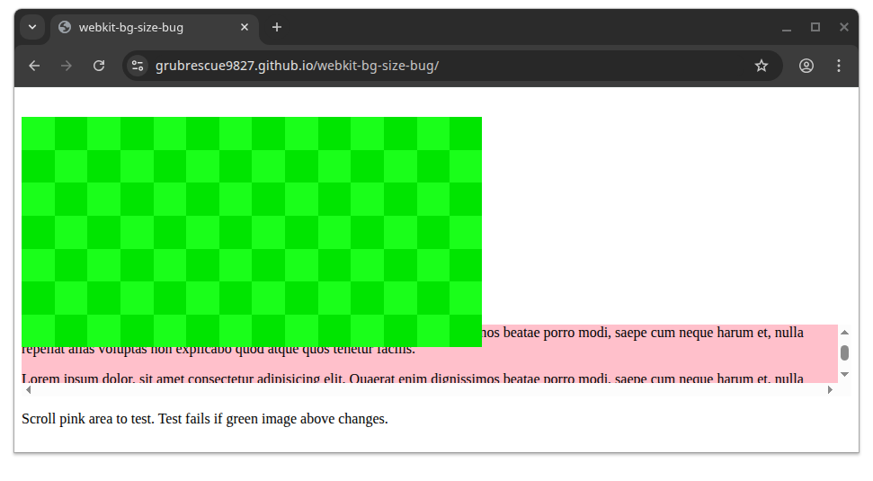
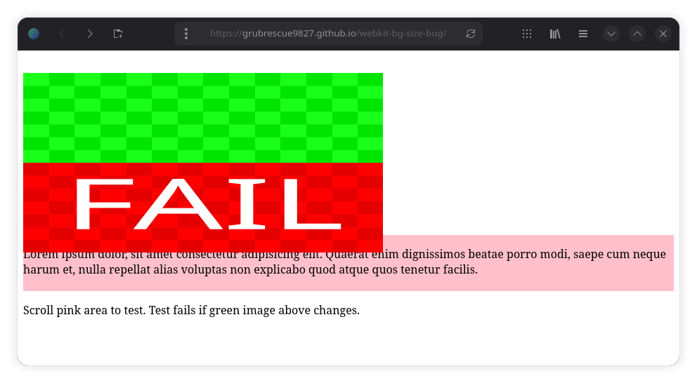

# webkit-bg-size-bug
Repo to reproduce a WebKitGTK bug in which an element will render at the wrong scale (ignoring background-size) when translated over a scrolling element. This only occurs after scrolling said scrollable element, and hardware accelerated compositing is enabled.

## Testing
Test page should render as shown below, even after scrolling the pink area (Chromium shown).

In GNOME Web, using WebkitGTK 2.52.3, the test fails upon scrolling the pink area:

The following configurations have been tested:
| **Config**                                               | **Result**                                      |
|----------------------------------------------------------|-------------------------------------------------|
| Firefox 150 Fedora 44 Wayland                            | PASS                                            |
| Chromium 147 Fedora 44 Wayland                           | PASS                                            |
| GNOME Web 50.3 Fedora 44 WebkitGTK 2.52.3 Wayland        | _FAIL_                                          |
| GNOME Web 46.5 Ubuntu 24.04 LTS WebkitGTK 2.50.4 Wayland | _FAIL_                                          |
| GNOME Web 46.5 Ubuntu 24.04 LTS WebkitGTK 2.50.4 X11     | _FAIL_                                          |
| Various Webkit based browsers via Browserling            | inconclusive pass: Might be using SW rendering. |

I do not have access to any modern Apple devices to test Safari unfortunately.

## Found Workarounds:
* Disable hw accel (`WEBKIT_DISABLE_COMPOSITING_MODE=1`)
* Set `background-repeat` to `repeat`
* Set `background-attachment` to `fixed` or `local`
